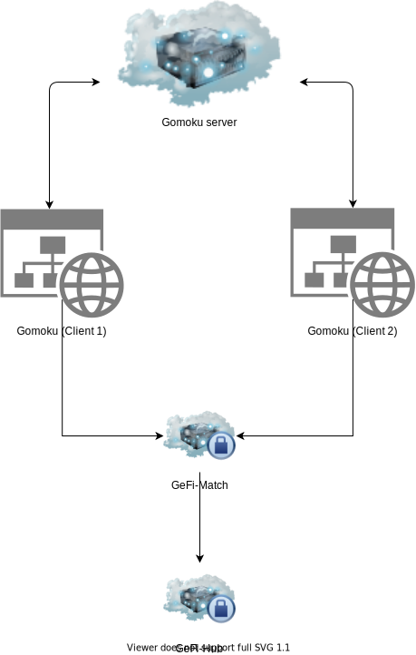

# GeFi MetaBuidl

## Brief Demo & Documentation

- See our brief demo at [here]((https://drive.google.com/file/d/1Z2DN3RMXi04FOZOIS1Gv8DXZ5kiB-QqX/view?usp=sharing))
- See our full demo at [here](https://drive.google.com/file/d/1Kh0PJr9w9ld7wIMpxSv-FLKB_TUnectH/view?usp=sharing)
- See full presentation video about GeFi at [here](https://drive.google.com/file/d/1eDRzMy9RQztbbEwTmqtrDiYRv0IrqSFU/view?usp=sharing)
- Our presentation at [here](https://docs.google.com/presentation/d/1A5BFNOpWhPq0lasenY7i9LesMRQ4PlyL/edit?usp=sharing&ouid=105350664043340718527&rtpof=true&sd=true)

## Project structure

This project have 4 sub-project

1. GeFi Hub: Contain the smart contract of GeFi-Hub
2. GeFi Match: Contain the smart contract of GeFi-Match
3. GeFi Gomoku: dApp (Web) - Gomoku game using GeFi-Match
4. GeFi Gomoku server: This server only broadcast event between competitors of ```GeFi Gomoku```

<center>



</center>