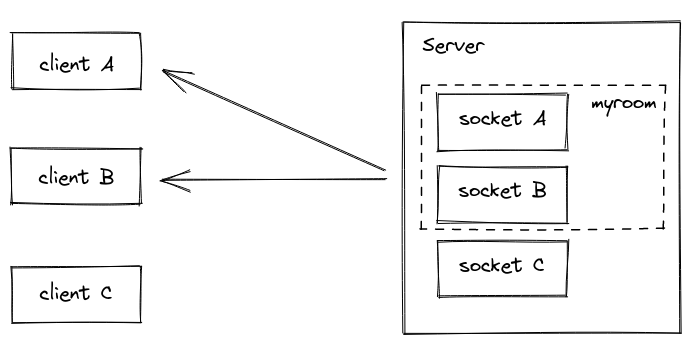

# Welcome to GeFi Gomoku Server

This server only broadcast the message between competitor in match. Using room domain, a feature of socket.io for broadcasting to every one in a room.

<center>



</center>

When a client create match, Server will create a room by using match Id. All of clients join to match also join to room in server.
Thus, Any player will broadcast his actions to all other players via the server.

## Steps to run this project

### Install all prerequisite

#### install node modules

```sh
npm i
npm i -g nodemon typedoc typescript
```

#### install PostgresSQL

* Windows

```url
https://www.postgresql.org/download/windows/
```

* Linux
  
```url
https://www.postgresql.org/download/
```

* macOSX
  
```url
https://www.postgresql.org/download/macosx/
```

#### install Visual studio code

```url
https://code.visualstudio.com/download
```

#### Run project

```sh
nodemon
```

By default, server will listen in port ```7000```
